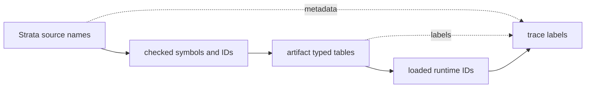

# Artifact And Runtime Boundary

Strata owns source syntax, diagnostics, semantic checking, checked IR, and
source-visible meaning. Lowering owns conversion from checked Strata IR into
Mantle Target Artifacts. Mantle owns artifact admission, runtime execution,
process and mailbox state, host boundaries, and observability.

This separation keeps names, metadata, and runtime identity from collapsing into
one surface. Source names are useful for diagnostics and traces, but executable
runtime dispatch must use loaded typed IDs.

Mantle crates are structurally language-neutral. They may carry `source_language`
as opaque artifact metadata, but they must not own Strata source constants,
Strata output-directory defaults, `.str` examples, or source-to-runtime gates.
Strata-owned defaults live in `crates/strata`; cross-boundary gates live in
`crates/strata-mantle-acceptance`.

Artifact type identity is structural in Mantle. Lowering emits a Mantle type
table and artifact records refer to entries by `TypeId`; Mantle admission and
runtime execution do not parse source type spellings or `ProcessRef<...>` text
to decide behavior. Type labels remain diagnostics and trace metadata only.

Artifact `source_hash_fnv1a64` is a non-authoritative diagnostic fingerprint for
correlating a lowered artifact with source text during local inspection. It is
not an integrity, provenance, authority, or trust decision input; artifact
admission must rely on explicit format/schema validation and typed structures.

Target requirements are checked/lowered facts embedded in the artifact. Strata
emits `target_requirements.source_language` and a sorted set of canonical
runtime feature IDs such as `bounded_mailbox`, `local_execution`, `local_send`,
`local_spawn`, `emit_effect`, and `typed_boundary_tables`. Mantle compares those
requirements with its runtime feature declaration before `ArtifactLoaded` or
executing runtime side effects; an unsupported feature fails closed with a
diagnostic such as `target runtime feature remote_spawn is not supported`.

## Admission

Mantle admits artifacts through validation, not filename trust. Before
execution, the artifact decoder and validator check:

- artifact magic, format, schema version, and source language;
- typed target requirements, including target source language and canonical
  runtime feature IDs;
- bounded process, message, state, output, transition, and action counts;
- bounded type table entries and type-kind targets;
- unique process debug names;
- unique typed state value identities per process;
- unique process reference names per process;
- unique typed authority descriptors, referenced authority IDs, and spawn-site
  table entries per process;
- typed protocol, port, and component boundary tables, including exact
  required-authority descriptors and port target process/message compatibility;
- typed component composition tables, including declared component instances,
  imported port bindings, protocol compatibility, and complete binding of every
  component import;
- either one unguarded transition per accepted message or one state-specific
  transition for each admitted state value;
- exact transition effect usage for emitted, spawned, and sent actions;
- transition references to known messages, state values, type IDs, process
  references, authority IDs, spawn-site IDs, outputs, and process IDs.

Decode-time bounds must happen before allocation when counts come from the
artifact body.

Mantle also publishes a typed `mantle.feature_declaration.v5` runtime feature
declaration. The current declaration names the artifact format and schema
version it admits, its opaque source-language metadata policy, local runtime
feature support, non-progress containment class, message-count mailbox model,
conservative message-observation support, allocation model, component/spawn
observability support, validity-window defaults, backend identity, and
explicit implementation limits such as remote send, remote spawn, and
distributed transport. Admission derives the minimum runtime feature set
required by the decoded `.mta` tables and requires the artifact's typed
`target_requirements` block to cover that set before `ArtifactLoaded` or any
runtime side effect.
Unsupported schema versions, unsupported required features, underdeclared
requirements, unsorted or duplicate requirement entries, mismatched
source-language metadata, and malformed requirement fields fail closed.

Strata owns requirement derivation. It derives requirements from checked IR and
lowering facts such as local execution, bounded mailboxes, emitted effects,
local spawn/send, typed effect outcomes, scalar value templates, runtime
branching, bounded runtime loops, typed boundary tables, and component
composition metadata. Mantle owns only the declaration and comparison; it does
not infer Strata source composition, imports, source names, authority widening,
or deployment safety.

## Internal Executable Plan

After a `.mta` decodes into a `LoadedProgram`, Mantle validates loaded admission
and then constructs an internal executable plan for runtime dispatch. The plan
pre-resolves transition dispatch, action blocks, process-reference targets,
spawn-site authority references, branch bodies, loop bodies, and value-template
program references into typed runtime structures. Runtime value templates are
compiled into Mantle-owned `ExecutableTemplateProgram` entries and runtime
actions/next-state plans carry `ExecutableValueTemplate` references rather than
walking recursive loaded artifact templates on the hot path. Process and message
labels may be borrowed for reports and traces, but they are not executable
dispatch keys.

The executable plan and executable template program are not serialized bytecode,
not Strata lowering targets, and not replacements for artifact validation.
Constructing them cannot grant authority or bypass feature, artifact, or
loaded-program admission. Invalid loaded references fail before `ArtifactLoaded`
and before host-visible runtime side effects. Source names, process debug names,
message labels, template labels, and other display strings remain diagnostics
and trace metadata; runtime dispatch and template execution use admitted typed
IDs and executable-plan references. Canonical type, variant, and field labels
are materialized only when Mantle constructs the bounded `RuntimeValue`
representation for payload/state data or trace/report rendering; executable
template plans carry typed IDs, not string selectors.

## Host Path Handling

Artifact and trace paths are validated before host IO. On Unix targets, Mantle
opens artifact and trace paths with descriptor-relative parent traversal and
`O_NOFOLLOW` so symlink parents and final symlink leaves fail closed at open
time. On Windows targets, Mantle opens final artifact and trace paths with
reparse-point traversal disabled, rejects reparse-point path components, and
validates the opened handle against the canonical path with stable Windows file
metadata. Other targets fail closed unless they provide equivalent secure path
support.

## Execution

Mantle executes from the admitted executable plan. Before emitting
`ArtifactLoaded` or executing runtime side effects, Mantle validates loaded
entry metadata, state tables, transition state targets and templates, outputs,
record field projections, and all plan-resolved action references. Record field
projection and record construction templates carry typed record-field IDs into
admitted record type shapes; record field names remain metadata for value
labels, diagnostics, and traces. Process references, sends, payload templates,
and transition effect usage are validated as typed IDs or admitted templates
before execution.
Loaded authority tables and spawn-site tables are validated before any runtime
side effect. A spawn action references a typed spawn-site ID; that site
references a typed authority ID whose descriptor must be an exact local
`Spawn` capability for the same target process. A typed boundary send through a
loaded `PortId` requires an exact process-local `PortConnect` authority for that
same port. Loaded authorities that are not referenced by any spawn site or
typed-port send are rejected as overbroad. Authority debug names and source
labels are metadata, not dispatch inputs.
A dequeued message selects the transition by typed message ID, and by admitted
current state ID when the transition table is state-specific. Dynamic next-state
templates resolve to an admitted state ID by typed state value identity, not by
display label text.

Typed boundary sends carry an optional admitted `PortId`. Mantle validates that
the port targets the same process as the send, that the port protocol message
type matches the target process message enum, and that the process authority
table admits the same port ID. Runtime dispatch still uses the loaded process
and message IDs; protocol, port, and component names are trace metadata only.
Invalid or denied boundary shapes fail artifact or loaded-program admission
before `ArtifactLoaded`; accepted typed boundary sends emit
`boundary_send_checked` during runtime dispatch.

Component composition metadata carries component-instance IDs and port IDs. It
is admitted as a typed graph: every instance must point at a component table
entry, every imported port edge must target a declared instance, the importing
component must declare that imported port, the exporting component must export
the bound port, protocols must match, and every component import on every
instance must be bound. Runtime dispatch does not look up component names or
source import names; the composition graph is metadata/admission data for the
already lowered typed IDs.
The checked composition admission report is a Strata-owned inspection surface
derived before Mantle execution. It records the diagnostic FNV-1a source
fingerprint, typed component-instance IDs, typed port-binding IDs, admitted
binding results, empty unsatisfied imports for admitted compositions, and
endpoint authority edges for review, but it is not an executable artifact and
Mantle does not read it.

The component-composition validation artifact is also Strata-owned and is emitted
by `strata composition build` as
`target/strata/<stem>.component-composition.json` by default. It self-identifies
as the checked-subset `strata.checked_component_composition` schema version `1.0`
with `hash_alg=fnv1a64-diagnostic`, carries source provenance as metadata whose
diagnostic source fingerprint must have the declared canonical lowercase
hexadecimal shape, and admits or rejects the checked local composition graph with
typed component-instance, component import/export port, port-binding, port,
protocol, and authority descriptor IDs. This is not the canonical
`strata.component_composition` deployment artifact described in
`docs/architecture`; it is deliberately not `.mta`, and Mantle does not execute
it in this slice. Binding classes that the current source subset cannot express
are present as empty arrays and fail closed if forged non-empty, keeping the
Strata-owned source evidence boundary explicit without inventing capability,
interface, runtime-feature, archive-format, crypto-policy, policy-hash, or
diagnostic-set facts.

Transition effect metadata is admitted with the artifact, loaded as runtime
effect usage, and must exactly match the action effects that execute.
Runtime `if` conditions are admitted as typed `Bool` value templates. Mantle
validates both branch bodies before execution, executes only the selected
branch, admits one direct nested runtime branch action layer, rejects deeper
direct branch nesting, rejects branch-local process-reference binding, and
records branch selection in the runtime trace. Runtime branch bodies
may contain admitted bounded loop actions; Mantle validates loop bodies before
execution and still rejects nested loops. Equality conditions are admitted as
typed value templates over `Bool` or payload-free enum operands; Mantle
evaluates admitted typed values, not source strings or debug labels.
Boolean predicate composition is admitted as a typed Bool value-template tree
built from `!`, `&&`, `||`, direct Bool templates, and typed equality templates.

The action set covers:

- emitting declared output;
- spawning a declared process through a process reference and admitted spawn
  authority;
- binding typed spawn and send effect outcomes in the pre-state action prefix;
- sending a declared message through a bound process reference;
- selecting a typed runtime branch over admitted action blocks;
- iterating over an admitted bounded list template with a typed active loop
  element binding.

The runtime fails closed on invalid sends, unbound process references, duplicate
process-reference bindings, mailbox exhaustion, runtime process instance budget
exhaustion, dispatch budget exhaustion, emitted-output budget exhaustion, and
trace budget exhaustion.

## Observability

Runtime traces are line-delimited JSON. They include labels for readability and
numeric IDs for process, message, state, payload type, and output identity. A
trace is evidence of runtime execution, not a substitute for running the
source-to-runtime gate.
Every emitted event also carries the Mantle-owned trace schema ID
`mantle-runtime-observability` and schema version `1`. The schema identifies the
observability contract only; it is not a `.mta` schema, serialized bytecode,
source semantic surface, retargeting input, or dispatch table. Trace validators
may check required fields, typed ID field shapes, `artifact_loaded`
first/no-repeat ordering, Mantle-contiguous spawned PID sequencing, and runtime
PID-to-process-ID correlation. Repository validation rejects fields outside the
per-event trace contract and checks grouped payload/loop fields, strict unsigned
integer syntax, u32 artifact typed-ID width, u16 branch-path segment width,
branch-path length, renderer-valid branch-path segment encoding, non-entry
spawn parent evidence, closed runtime enum value domains, process lifecycle
causality boundaries after terminal stop/fail events, and artifact process-ID
bounds. Lifecycle causality validation requires active parent/sender/supervisor
PIDs for events that imply runtime action. Supervisor restart validation also
requires prior child-start evidence for the same typed supervisor/child slot, a
terminal event for the current child PID, and a distinct active replacement PID
spawned by the supervisor for restarted decisions. It also rejects impossible
restart-window evidence such as zero limits/windows, observed counts above the
configured limit, restarted decisions with zero count, and non-restarted
decisions with nonzero count, while still allowing typed evidence to reference
the terminated child when reporting a supervisor decision.
Validators apply explicit byte, event, and runtime-process limits, remain
read-only, and never turn labels, source names, process names, message labels,
or debug strings into executable meaning.

`mantle inspect-authority` is a read-only inspection command for admitted
artifacts. It validates the `.mta` through the same artifact reader used before
execution, then prints the typed authority and spawn-site tables. It does not
dispatch by source names, execute runtime actions, or generate a mandatory
report; JSON output is available only when explicitly requested by the caller.
The source-side composition report is emitted by `strata composition-report`.
The durable checked-subset source-side component-composition artifact is emitted
by `strata composition build` and validated by `strata composition admit`. Both
are separate from `mantle inspect-authority`, canonical deployment-composition
artifacts, and `.mta` admission.

Target binding inspection is split along the same boundary:

- `strata target-requirements <path.str>` checks and lowers the source, then
  renders the typed requirements Strata would place in the `.mta`.
- `mantle feature-declaration` renders the current Mantle runtime feature
  declaration.
- `mantle admit <path.mta>` decodes and validates the `.mta`, compares typed
  target requirements against the Mantle declaration, and returns before
  executing runtime behavior.
