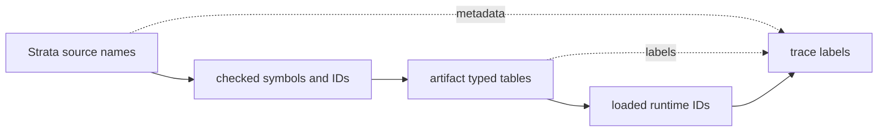

# Artifact And Runtime Boundary

Strata owns source syntax, diagnostics, semantic checking, checked IR, and
source-visible meaning. Lowering owns conversion from checked Strata IR into
Mantle Target Artifacts. Mantle owns artifact admission, runtime execution,
process and mailbox state, host boundaries, and observability.

This separation keeps names, metadata, and runtime identity from collapsing into
one surface. Source names are useful for diagnostics and traces, but executable
runtime dispatch must use loaded typed IDs.

Mantle crates are structurally language-neutral. They may carry `source_language`
as opaque artifact metadata, but they must not own Strata source constants,
Strata output-directory defaults, `.str` examples, or source-to-runtime gates.
Strata-owned defaults live in `crates/strata`; cross-boundary gates live in
`crates/strata-mantle-acceptance`.

Artifact type identity is structural in Mantle. Lowering emits a Mantle type
table and artifact records refer to entries by `TypeId`; Mantle admission and
runtime execution do not parse source type spellings or `ProcessRef<...>` text
to decide behavior. Type labels remain diagnostics and trace metadata only.

Artifact `source_hash_fnv1a64` is a non-authoritative diagnostic fingerprint for
correlating a lowered artifact with source text during local inspection. It is
not an integrity, provenance, authority, or trust decision input; artifact
admission must rely on explicit format/schema validation and typed structures.

## Admission

Mantle admits artifacts through validation, not filename trust. Before
execution, the artifact decoder and validator check:

- artifact magic, format, schema version, and source language;
- bounded process, message, state, output, transition, and action counts;
- bounded type table entries and type-kind targets;
- unique process debug names;
- unique typed state value identities per process;
- unique process reference names per process;
- unique typed authority descriptors, referenced authority IDs, and spawn-site
  table entries per process;
- typed protocol, port, and component boundary tables, including exact
  required-authority descriptors and port target process/message compatibility;
- typed component composition tables, including declared component instances,
  imported port bindings, protocol compatibility, and complete binding of every
  component import;
- either one unguarded transition per accepted message or one state-specific
  transition for each admitted state value;
- exact transition effect usage for emitted, spawned, and sent actions;
- transition references to known messages, state values, type IDs, process
  references, authority IDs, spawn-site IDs, outputs, and process IDs.

Decode-time bounds must happen before allocation when counts come from the
artifact body.

## Host Path Handling

Artifact and trace paths are validated before host IO. On Unix targets, Mantle
opens artifact and trace paths with descriptor-relative parent traversal and
`O_NOFOLLOW` so symlink parents and final symlink leaves fail closed at open
time. On Windows targets, Mantle opens final artifact and trace paths with
reparse-point traversal disabled, rejects reparse-point path components, and
validates the opened handle against the canonical path with stable Windows file
metadata. Other targets fail closed unless they provide equivalent secure path
support.

## Execution

Mantle loads admitted transitions into indexed runtime tables. Before emitting
`ArtifactLoaded` or executing runtime side effects, Mantle validates loaded
entry metadata, state tables, transition state targets and templates, outputs,
and record field projections. Record field projection and record construction
templates carry typed record-field IDs into admitted record type shapes; record
field names remain metadata for value labels, diagnostics, and traces. Process
references, sends, payload templates, and transition effect usage are validated
as typed IDs or admitted templates before execution.
Loaded authority tables and spawn-site tables are validated before any runtime
side effect. A spawn action references a typed spawn-site ID; that site
references a typed authority ID whose descriptor must be an exact local
`Spawn` capability for the same target process. A typed boundary send through a
loaded `PortId` requires an exact process-local `PortConnect` authority for that
same port. Loaded authorities that are not referenced by any spawn site or
typed-port send are rejected as overbroad. Authority debug names and source
labels are metadata, not dispatch inputs.
A dequeued message selects the transition by typed message ID, and by admitted
current state ID when the transition table is state-specific. Dynamic next-state
templates resolve to an admitted state ID by typed state value identity, not by
display label text.

Typed boundary sends carry an optional admitted `PortId`. Mantle validates that
the port targets the same process as the send, that the port protocol message
type matches the target process message enum, and that the process authority
table admits the same port ID. Runtime dispatch still uses the loaded process
and message IDs; protocol, port, and component names are trace metadata only.
Invalid or denied boundary shapes fail artifact or loaded-program admission
before `ArtifactLoaded`; accepted typed boundary sends emit
`boundary_send_checked` during runtime dispatch.

Component composition metadata carries component-instance IDs and port IDs. It
is admitted as a typed graph: every instance must point at a component table
entry, every imported port edge must target a declared instance, the importing
component must declare that imported port, the exporting component must export
the bound port, protocols must match, and every component import on every
instance must be bound. Runtime dispatch does not look up component names or
source import names; the composition graph is metadata/admission data for the
already lowered typed IDs.

Transition effect metadata is admitted with the artifact, loaded as runtime
effect usage, and must exactly match the action effects that execute.
Runtime `if` conditions are admitted as typed `Bool` value templates. Mantle
validates both branch bodies before execution, executes only the selected
branch, admits one direct nested runtime branch action layer, rejects deeper
direct branch nesting, rejects branch-local process-reference binding, and
records branch selection in the runtime trace. Runtime branch bodies
may contain admitted bounded loop actions; Mantle validates loop bodies before
execution and still rejects nested loops. Equality conditions are admitted as
typed value templates over `Bool` or payload-free enum operands; Mantle
evaluates admitted typed values, not source strings or debug labels.
Boolean predicate composition is admitted as a typed Bool value-template tree
built from `!`, `&&`, `||`, direct Bool templates, and typed equality templates.

The action set covers:

- emitting declared output;
- spawning a declared process through a process reference and admitted spawn
  authority;
- sending a declared message through a bound process reference;
- selecting a typed runtime branch over admitted action blocks;
- iterating over an admitted bounded list template with a typed active loop
  element binding.

The runtime fails closed on invalid sends, unbound process references, duplicate
process-reference bindings, mailbox exhaustion, runtime process instance budget
exhaustion, dispatch budget exhaustion, emitted-output budget exhaustion, and
trace budget exhaustion.

## Observability

Runtime traces are line-delimited JSON. They include labels for readability and
numeric IDs for process, message, state, payload type, and output identity. A
trace is evidence of runtime execution, not a substitute for running the
source-to-runtime gate.

`mantle inspect-authority` is a read-only inspection command for admitted
artifacts. It validates the `.mta` through the same artifact reader used before
execution, then prints the typed authority and spawn-site tables. It does not
dispatch by source names, execute runtime actions, or generate a mandatory
report; JSON output is available only when explicitly requested by the caller.
