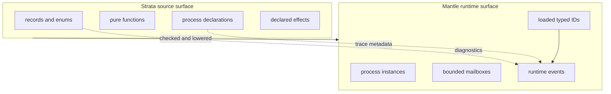
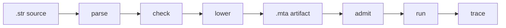

# Language Concepts

Strata is a source language for explicit state, explicit effects, typed
messages, and runtime-observable process execution.

The implementation is intentionally small. The `.str` source surface declares
source-level records, enums, pure source functions, processes, message types,
state types, and process transitions. Mantle executes the admitted artifact
produced from that source.

## Source Versus Runtime

Strata source is where author-visible meaning lives:

- names;
- records;
- enums;
- source functions;
- process declarations;
- message declarations;
- state transition expressions;
- declared effects.

Mantle runtime is where admitted execution lives:

- process instances;
- process references;
- mailboxes;
- loaded typed IDs;
- transition tables;
- runtime events;
- trace output.

The two surfaces are related, but not interchangeable. Source labels are useful
for diagnostics and traces. Runtime dispatch uses loaded typed IDs.



## Processes

A Strata program is organized around processes. A process declares:

- a bounded mailbox;
- a state type;
- a message type;
- an `init` function that creates the initial state;
- optional pure process-local functions;
- a `step` function that handles messages and returns a transition result.

The entry process is named `Main`. Mantle starts `Main` and delivers its first
message variant as the entry message.

Spawning a process creates a runtime process instance and binds it to an
immutable typed process reference value:

```strata
authority spawn_worker: Cap<Spawn<Worker>>;

let worker: ProcessRef<Worker> = spawn Worker;
```

The authority declaration is process-local, exact for the target process, and
must be used by a local spawn site. The reference is local to the transition that
spawned it. Multiple references may target the same process definition, which
creates multiple runtime instances.

## Messages

A process message type is an enum. Each variant is a message the process can
accept.

```strata
enum WorkerMsg {
    Ping,
    Assign(Job),
}
```

Sends are statically checked against the target process message enum:

```strata
send worker Ping;
send worker Assign(Job { phase: Ready });
```

Payload variants carry one immutable value. Actor `step` parameter patterns can
bind that payload, and whole-body `match msg` arms can bind the same payload:

```strata
fn step(state: WorkerState, Assign(job: Job)) -> ProcResult<WorkerState> ! [] ~ [] @det {
    return Stop(WorkerState { job: job });
}
```

## Source Functions

Strata accepts pure source functions at module level and inside processes.
Functions are checked and expanded before lowering; Mantle does not dispatch by
function names at runtime.

```strata
fn readiness(Warm) -> Readiness ! [] ~ [] @det {
    return WarmReady;
}

fn state_for(mode: StartupMode) -> MainState ! [] ~ [] @det {
    match mode {
        Cold => {
            return MainState { readiness: ColdReady };
        }
        Warm => {
            return MainState { readiness: WarmReady };
        }
    }
}
```

Source functions are immutable value producers. They perform no statements, use
`! [] ~ [] @det`, and return whole values. A process-local function can
encapsulate non-message-handling value construction for `init`, `step` results,
and send payloads.

Payload-bearing enum constructors are source values too. A function may match
`Assigned(job: Job)` in a signature pattern or whole-body match, and the payload
binding is an immutable value scoped to that clause or arm.

## State

Process state is immutable at the source level. A transition returns a whole
replacement state or the supplied state.

```strata
return Continue(SawFirst);
return Stop(state);
return Panic(Failed);
```

`Panic(value)` is an abnormal terminal result: Mantle records the replacement
state and failure evidence, fails the run, and does not replay the consumed
message.

There is no assignment statement and no field update expression. Record state is
constructed as a new whole value:

```strata
return Continue(WorkerState { phase: Idle });
```

## Effects

Effects must be visible in the function signature. The effects are:

- `emit`;
- `spawn`;
- `send`.

The declared effect list must exactly match the effects used by each `step`
clause. For `spawn`, the effect list is separate from the typed
`Cap<Spawn<Target>>` authority descriptor.

```strata
fn step(state: MainState, Start) -> ProcResult<MainState> ! [spawn, send] ~ [] @det {
    let worker: ProcessRef<Worker> = spawn Worker;
    send worker Ping;
    return Stop(state);
}
```

This is deliberately stricter than "allow anything in the list." A declared but
unused effect is rejected.

Effectful local sends can also be bound as immutable typed outcomes:

```strata
let sent: Result<Unit,SendError<WorkerMsg>> = send worker Ping;
```

The outcome is a source-visible value, not an exception path. Mantle commits an
accepted message and returns `Ok(Unit)`. If local delivery fails before
acceptance, the `SendError<WorkerMsg>` value preserves the original message.
Local spawn outcomes use `Result<ProcessRef<TargetProcess>,SpawnError<Unit>>`;
accepted spawns return the committed process reference as step-local authority.

## Determinism And May-Behaviors

Function signatures include determinism and may-behavior positions:

```strata
! [effects] ~ [may_behaviors] @det
```

Buildable source requires `~ [] @det`. The parser recognizes `@nondet`, but
accepted buildable programs are deterministic.

## Execution Shape

The source-to-runtime path is:



Each phase has a different responsibility. Parser success alone does not mean a
program is accepted. A program must also pass semantic checking, artifact
validation, and runtime admission.
