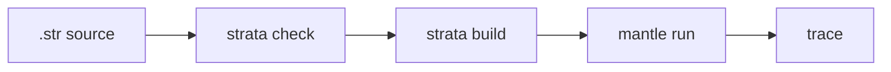

# Language Surface Proof Substrate

The current language surface proof substrate is an executable, machine-readable
model of the implemented Strata and Mantle surface. It maps the agreed proof
domains for the current language surface to declared feature entries, maps those
entries to typed proof obligations, and maps those obligations to the evidence
classes required for that feature: parser coverage, checker/static validation,
checked IR and lowering coverage, Strata/Mantle boundary preservation, Mantle
artifact admission, runtime execution, diagnostics, examples, positive and
negative tests, source-to-runtime gates, fuzz seeds, and bounded or property
coverage where that evidence applies.
Typed scalar values and value operators are part of the runtime-bearing
surface: their source syntax, checked folding, typed lowering, Mantle artifact
admission, typed value-if templates, runtime evaluation, and fail-closed
diagnostics are all recorded in the inventory.
Typed effect outcomes are also runtime-bearing: source-visible send/spawn
`Result` bindings, checked outcome templates, Mantle artifact admission, runtime
commit-or-return behavior, spawn success process-reference evidence,
source-to-runtime success plus `Full` pre-acceptance capacity,
stopped-target `Stopped`, runtime-unit `MailboxClosed` supervisor-closure,
inactive-child `Crashed`, denied/exhausted/backend-unavailable spawn failure
evidence, parse/check/lower, artifact-decode,
and runtime-from-source fuzz seeds, bounded
state-admission evidence, and diagnostics are recorded together.
Local spawn authority is recorded as a runtime-bearing boundary feature:
process-local `Cap<Spawn<Target>>` declarations, exact checked target matching,
typed authority IDs, typed spawn-site IDs, Mantle artifact and loaded-runtime
admission, overbroad-authority rejection, `spawn_authority_checked` trace
evidence, `Err(Denied(Unit))` runtime denial before acceptance,
source-to-runtime gates, fuzz seeds, bounded authority-model evidence,
diagnostics, and docs are tracked together.

Local supervision is recorded as a runtime-bearing boundary feature: local
`one_for_one` supervisor declarations, lexical child IDs, child restart modes,
explicit restart intensity, lexical spawn-site classification, Mantle artifact
and loaded-runtime admission, acyclic child-graph validation, restart trace
evidence, no message replay after panic, source-to-runtime gates, fuzz seeds,
diagnostics, and docs are tracked together.

Source-unit imports are recorded as a Strata-owned composition feature:
`import module_name;` syntax, root source loading, typed source-unit IDs, an
acyclic dependency graph, deterministic dependency-first checking, duplicate and
ambiguous-name rejection, direct-import symbol validation, source-to-runtime
execution from a multi-file program, fuzz seeds, diagnostics, and docs are
tracked together. Mantle import resolution is not part of the surface; module
names in artifacts remain metadata.

Typed protocol, port, and component boundaries are recorded as a
runtime-bearing boundary feature: source declarations, optional `send ... via
Port` syntax, process-local `Cap<PortConnect<Port>>` authority, checked
protocol/port/component IDs, direct-import validation, deterministic lowering
into Mantle boundary tables, artifact and loaded-runtime admission,
accepted `boundary_send_checked` trace evidence, fail-closed admission
diagnostics for denied boundary shapes, source-to-runtime execution, fuzz seeds,
bounded deterministic lowering evidence, diagnostics, and docs are tracked
together. Mantle does not resolve protocol, port, component, or import names at
runtime; those names remain metadata.

Checked local component port-binding composition admission is recorded as a
runtime-bearing boundary feature: component import lists, local `composition`
declarations, implementation-local source admission input, typed
component-instance IDs, typed port-binding edges, direct-import validation,
duplicate and unbound import rejection, unimported-port binding rejection,
protocol mismatch rejection, deterministic graph lowering, Mantle
composition-table admission, Strata-owned composition admission report emission,
Strata-owned `strata.checked_component_composition` artifact build/admit
coverage, source-to-runtime execution, fuzz seeds, performance-smoke evidence,
diagnostics, and docs are tracked together. The report and the durable artifact
record the diagnostic FNV-1a source fingerprint, typed component-instance IDs,
component import/export port obligations, typed port-binding IDs, admitted
binding results, empty unsatisfied imports for admitted compositions, endpoint
port authority requirements, and cross-component authority edges for
review/admission. The artifact is emitted as
`target/strata/<stem>.component-composition.json`, self-identifies with schema
ID/version/source-language fields, and fails closed when typed IDs are missing,
duplicated, malformed, stripped of required binding evidence, internally
inconsistent with authority descriptors, or inconsistent with admission results.
It validates the artifact schema and internal typed-ID consistency; it is not a
source re-check, not a tamperproof attestation for a coherently rewritten JSON
file, and not directly executable Mantle input. `strata composition bind-runtime`
adds the explicit deployment-admission bridge by validating an admitted checked
composition artifact against a matching `.mta` and rendering the separate
`mantle.runtime_composition_binding` JSON artifact. That binding must match the
`.mta` module, source fingerprint, composition ID, component instances, runtime
process IDs, and port bindings before Mantle can use it for observability
correlation. The checked composition artifact remains Strata-owned and not
`.mta`; checked IR lowering, Mantle artifact admission, and explicit runtime
binding admission remain separate evidence classes. Mantle admits typed
composition metadata inside `.mta` but does not resolve source component names,
source-unit imports, source strings, Strata composition artifacts, or report data
at runtime.

Runtime feature declaration and target binding are recorded as a
runtime-bearing boundary feature: Strata derives canonical typed target
requirements from checked IR and lowering facts, embeds them in the `.mta`,
renders them through `strata target-requirements`, Mantle renders its own typed
`mantle.feature_declaration.v5` declaration, and Mantle admission compares the
artifact's format, schema version, source language, declared runtime features,
and artifact-derived minimum required features before execution. The runtime
declaration includes conservative message-observation fields and explicit
validity-window defaults without claiming distributed transport support.
Mismatched or malformed source-language metadata, unsupported runtime
features, underdeclared requirements, malformed requirement fields, remote
send/spawn, and distributed transport remain fail-closed implementation limits.
The evidence includes unit, negative, bounded determinism, source-to-runtime,
acceptance, fuzz-seed, performance-smoke, docs, and assurance matrix coverage;
it does not claim theorem-prover coverage.

Mantle executable-plan construction is recorded as an internal runtime
implementation feature: Mantle validates a loaded `.mta`, builds typed
dispatch/action tables and a Mantle-owned executable template program from the
admitted `LoadedProgram`, and executes from those pre-resolved plan references.
The evidence covers plan construction, deterministic transition ordering, typed
action tables, executable next-state/send/for-each template refs,
source-name/debug-label retargeting attempts, invalid loaded-template reference
rejection before `ArtifactLoaded`, runtime execution equivalence,
source-to-runtime gates, performance-smoke coverage, and docs. This evidence
does not add a serialized bytecode format, a Strata lowering target, new source
semantics, new fuzz decoder seeds, or new unsafe indexing assumptions; it
remains bounded machine-checked assurance.

Runtime trace observability is recorded as a Mantle-owned runtime feature:
runtime events are strongly typed before rendering, JSONL output carries the
`mantle-runtime-observability` schema ID and version, and the validator checks
required fields, exact per-event field sets, grouped payload/loop fields, typed
ID fields, strict unsigned integer syntax, u16 branch path segments plus
bounded path length, closed runtime enum value domains, u32 artifact typed-ID
width, artifact process-ID bounds, `artifact_loaded` first/no-repeat ordering,
Mantle-contiguous spawned PID sequencing, non-entry spawn parent evidence,
runtime PID-to-process-ID correlation, optional runtime-composition correlation
field grouping plus whole-trace composition identity stability, supervisor-child
restart causality, and restart-window numeric bounds/coupling using borrowed
line scans over already-read trace text.
Deployment, composition, and component-instance trace fields appear only when
Mantle was explicitly launched with an admitted `mantle.runtime_composition_binding`
artifact; absent binding input leaves those fields absent and forbids fabricated
IDs.
Validation is capped by explicit trace-byte, event-count, and runtime-process
limits before trace evidence is used by a gate.
The evidence includes unit and negative schema tests, source-to-runtime trace
validation, fuzz seeds for malformed traces, bounded rendered-all-event
contract evidence for metadata-vs-typed-ID separation, JSONL performance-smoke
coverage, docs, and assurance matrix coverage. No new unsafe code, arena
indexing assumption, or unchecked correlation path is introduced by the trace
validator, so this slice does not add a new Miri-specific target beyond the
existing `just miri-ci` disposition. The trace contract remains observability
evidence only; it is not an artifact format, Strata lowering target, source
semantic surface, or executable dispatch input.

Run it with:

```sh
just language-surface-assurance
```

The machine-readable inventory is rooted in:

```text
crates/strata-mantle-acceptance/tests/language_surface_assurance.rs
```

The proof-domain declarations and feature declarations are split by surface
under:

```text
crates/strata-mantle-acceptance/tests/language_surface_assurance/
```

The gate fails when a declared proof domain is missing, when a declared language
surface feature is not included in a proof domain, when a domain omits a proof
obligation implied by its features, when an obligation has no supporting
evidence class, when a feature is missing one of its required evidence classes,
when an evidence path disappears, or when the recorded marker no longer exists
in the cited file. Source-to-runtime evidence must point at the active
`Justfile` check/build/run commands for the cited source example. The inventory
also fails if an evidence class is incompatible with the feature's declared
surface layer, so source-only, checker/lowering, artifact-admission, runtime,
docs/example, and future/non-admitted classifications remain distinct.

This gate is the current-language-surface proof substrate for implementation
claims. It is not a full theorem-prover proof of every semantic rule, and it
does not replace runnable source-to-runtime behavior:



Runtime-bearing features still need source-to-runtime evidence. Trace labels,
source names, and documentation text remain metadata and diagnostics surfaces;
executable behavior must cross the Strata/Mantle boundary as checked IR, typed
IDs, typed value templates, and admitted Mantle artifacts. Record field
projection is represented as admitted record-field IDs; source field names
remain labels, diagnostics, and trace metadata.
