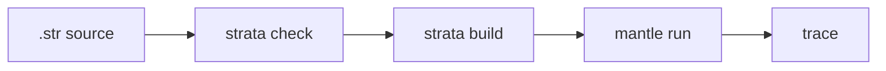

# Language Surface Proof Substrate

The current language surface proof substrate is an executable, machine-readable
model of the implemented Strata and Mantle surface. It maps the agreed proof
domains for the current language surface to declared feature entries, maps those
entries to typed proof obligations, and maps those obligations to the evidence
classes required for that feature: parser coverage, checker/static validation,
checked IR and lowering coverage, Strata/Mantle boundary preservation, Mantle
artifact admission, runtime execution, diagnostics, examples, positive and
negative tests, source-to-runtime gates, fuzz seeds, and bounded or property
coverage where that evidence applies.
Typed scalar values and value operators are part of the runtime-bearing
surface: their source syntax, checked folding, typed lowering, Mantle artifact
admission, typed value-if templates, runtime evaluation, and fail-closed
diagnostics are all recorded in the inventory.
Typed effect outcomes are also runtime-bearing: source-visible send/spawn
`Result` bindings, checked outcome templates, Mantle artifact admission, runtime
commit-or-return behavior, spawn success process-reference evidence,
source-to-runtime success plus `Full`/`Stopped` pre-acceptance failure examples,
direct runtime `Crashed` failure evidence, typed `MailboxClosed` admission,
parse/check/lower, artifact-decode, and runtime-from-source fuzz seeds, bounded
state-admission evidence, and diagnostics are recorded together.
Local spawn authority is recorded as a runtime-bearing boundary feature:
process-local `Cap<Spawn<Target>>` declarations, exact checked target matching,
typed authority IDs, typed spawn-site IDs, Mantle artifact and loaded-runtime
admission, overbroad-authority rejection, `spawn_authority_checked` trace
evidence, `Err(Denied(Unit))` runtime denial before acceptance,
source-to-runtime gates, fuzz seeds, bounded authority-model evidence,
diagnostics, and docs are tracked together.

Local supervision is recorded as a runtime-bearing boundary feature: local
`one_for_one` supervisor declarations, lexical child IDs, child restart modes,
explicit restart intensity, lexical spawn-site classification, Mantle artifact
and loaded-runtime admission, acyclic child-graph validation, restart trace
evidence, no message replay after panic, source-to-runtime gates, fuzz seeds,
diagnostics, and docs are tracked together.

Source-unit imports are recorded as a Strata-owned composition feature:
`import module_name;` syntax, root source loading, typed source-unit IDs, an
acyclic dependency graph, deterministic dependency-first checking, duplicate and
ambiguous-name rejection, direct-import symbol validation, source-to-runtime
execution from a multi-file program, fuzz seeds, diagnostics, and docs are
tracked together. Mantle import resolution is not part of the surface; module
names in artifacts remain metadata.

Typed protocol, port, and component boundaries are recorded as a
runtime-bearing boundary feature: source declarations, optional `send ... via
Port` syntax, process-local `Cap<PortConnect<Port>>` authority, checked
protocol/port/component IDs, direct-import validation, deterministic lowering
into Mantle boundary tables, artifact and loaded-runtime admission,
accepted `boundary_send_checked` trace evidence, fail-closed admission
diagnostics for denied boundary shapes, source-to-runtime execution, fuzz seeds,
bounded deterministic lowering evidence, diagnostics, and docs are tracked
together. Mantle does not resolve protocol, port, component, or import names at
runtime; those names remain metadata.

Checked local component port-binding composition admission is recorded as a
runtime-bearing boundary feature: component import lists, local `composition`
declarations, implementation-local source admission input, typed
component-instance IDs, typed port-binding edges, direct-import validation,
duplicate and unbound import rejection, unimported-port binding rejection,
protocol mismatch rejection, deterministic graph lowering, Mantle
composition-table admission, Strata-owned composition admission report emission,
source-to-runtime execution, fuzz seeds, performance-smoke evidence, diagnostics,
and docs are tracked together. The report records the diagnostic FNV-1a source
fingerprint, typed component-instance IDs, typed port-binding IDs, admitted
binding results, empty unsatisfied imports for admitted compositions, endpoint
port authority requirements, and cross-component authority edges for review.
The report is evidence for the Strata-owned review surface; checked IR lowering
and Mantle artifact admission remain the evidence classes that satisfy the
Strata/Mantle boundary obligation. Mantle admits typed composition metadata but
does not resolve source component names, source-unit imports, source strings, or
report data at runtime.

Run it with:

```sh
just language-surface-assurance
```

The machine-readable inventory is rooted in:

```text
crates/strata-mantle-acceptance/tests/language_surface_assurance.rs
```

The proof-domain declarations and feature declarations are split by surface
under:

```text
crates/strata-mantle-acceptance/tests/language_surface_assurance/
```

The gate fails when a declared proof domain is missing, when a declared language
surface feature is not included in a proof domain, when a domain omits a proof
obligation implied by its features, when an obligation has no supporting
evidence class, when a feature is missing one of its required evidence classes,
when an evidence path disappears, or when the recorded marker no longer exists
in the cited file. Source-to-runtime evidence must point at the active
`Justfile` check/build/run commands for the cited source example. The inventory
also fails if an evidence class is incompatible with the feature's declared
surface layer, so source-only, checker/lowering, artifact-admission, runtime,
docs/example, and future/non-admitted classifications remain distinct.

This gate is the current-language-surface proof substrate for implementation
claims. It is not a full theorem-prover proof of every semantic rule, and it
does not replace runnable source-to-runtime behavior:



Runtime-bearing features still need source-to-runtime evidence. Trace labels,
source names, and documentation text remain metadata and diagnostics surfaces;
executable behavior must cross the Strata/Mantle boundary as checked IR, typed
IDs, typed value templates, and admitted Mantle artifacts. Record field
projection is represented as admitted record-field IDs; source field names
remain labels, diagnostics, and trace metadata.
