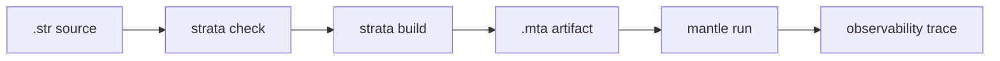

# Source-To-Runtime Gates

A runtime-bearing milestone is not complete until the command a user would run
succeeds. Documentation and generated artifacts do not replace executable
source-to-runtime behavior.

The normal gate shape is:



For fail-closed runtime behavior, the source must check and build, and
`mantle run` must fail only after Mantle validates the artifact and emits trace
evidence for the failure. Source-level rejection gates are different: they must
fail before build/lowering and must not leave a target artifact behind.

## Canonical Gates

The canonical user-facing gate is:

```sh
just source-to-runtime-gates
```

The split entrypoints are available when only one side of the gate is needed:

```sh
just source-to-runtime-success-gates
just source-to-runtime-failure-gates
```

The maintained command list belongs in the executable gate definitions:

- `Justfile` owns the commands a user or CI runner executes.
- `crates/strata-mantle-acceptance/tests/source_to_runtime_gates.rs` is the root
  integration harness, with focused gate families under
  `crates/strata-mantle-acceptance/tests/source_to_runtime_gates/`.
- `docs/src/examples.md` owns the curated list of runnable examples. The
  grouped example pages document the behavior each example demonstrates.

This page intentionally does not enumerate every runtime gate. When a new
user-visible language or runtime behavior needs source-to-runtime proof, update
the executable gate and document the example in the grouped example pages.

The language surface proof substrate checks that the agreed current-surface
proof domains map to declared features and that those features point at the
required parser, checker, lowering, boundary, artifact, runtime, diagnostics,
example, test, fuzz, and bounded/property evidence classes where those classes
apply. It also checks that each proof domain declares the proof obligations
implied by those features. That substrate supports implementation claims; it
does not replace this executable gate shape.

## Representative Commands

The minimum success gate checks, builds, runs, and traces `hello.str`:

```sh
just run-example hello
```

A richer state/payload gate follows the same shape:

```sh
just run-example state_payload_match
```

The source-unit import gate starts at a root source file and proves that Strata,
not Mantle, resolves the reachable dependency graph before lowering:

```sh
just run-example imports_main
```

The typed boundary contract gate proves protocol, port, component, and
process-local `PortConnect` declarations check before lowering and run through
Mantle-admitted typed IDs:

```sh
just run-example boundary_contracts_main
```

The component composition gate proves source-unit reachability plus typed
component import binding before lowering, then runs the admitted artifact without
runtime source-name resolution:

```sh
just run-example component_composition_main
just strata-composition-report examples/component_composition_main.str json
just strata-target-requirements examples/component_composition_main.str json
just mantle-feature-declaration json
just mantle-admit target/strata/component_composition_main.mta json
```

This target-binding gate keeps the boundary explicit. Strata reports the typed
runtime features required by the checked program; Mantle reports the typed
features it currently supports; Mantle admission compares those sets before
execution. Source imports, component names, authority labels, and report data
remain diagnostics and metadata.

An immutable source computation gate proves sequential source-local bindings are
resolved before lowering while Mantle executes only typed artifact data:

```sh
just run-example function_local_bindings
```

A scalar computation gate proves typed scalar payloads, immutable process-local
scalar functions, runtime scalar predicates, runtime-bound value conditionals,
and Mantle execution of typed scalar templates:

```sh
just run-example runtime_scalar_priority
```

A selected return-match arm-prefix gate proves source-selected dispatch before
Mantle executes typed runtime arm actions:

```sh
just run-example process_return_match_arm_runtime_if_prefix
just run-example process_return_match_arm_for_prefix
just run-example process_return_match_arm_for_if_prefix
just run-example process_return_match_arm_if_for_prefix
```

A runtime control-flow gate checks, builds, validates, runs, and traces typed
Mantle execution:

```sh
just run-example runtime_guard_noop
just run-example runtime_scalar_priority
just run-example runtime_nested_if_actions
just run-example runtime_final_if_guarded_loop
just run-example runtime_final_if_nested_if_actions
just run-example runtime_final_if_nested_terminal_if
just run-example runtime_for_each
just run-example runtime_for_each_empty
just run-example runtime_for_each_if
just run-example runtime_for_each_nested_if_actions
just run-example runtime_guarded_for_each
just run-example runtime_guarded_ref_loop
just run-example runtime_guarded_ref_loop_jobs
just run-example runtime_loop_element_projection
just run-example effect_outcomes
just run-example effect_outcome_mailbox_full
just run-example effect_outcome_stopped_target
just run-example local_supervision_restart
just run-example local_supervision_permanent_stop
just run-example local_supervision_temporary
just run-example local_supervision_transient_restart
just run-example local_supervision_transient
just run-example local_supervision_inactive_send_outcome
```

The local spawn authority denial gate uses the same check/build path and then
runs Mantle with denied admitted spawn authority:

```sh
just strata-check examples/effect_outcome_spawn_denied.str
just strata-build examples/effect_outcome_spawn_denied.str
just mantle-run-deny-spawn-authority target/strata/effect_outcome_spawn_denied.mta
```

A source rejection gate must fail during checking and must not create a target
artifact:

```sh
just strata-check examples/failures/effect_authority_missing.str
just strata-check examples/failures/source_local_binding_process_ref_carrier_enum.str
just strata-check examples/failures/scalar_overflow.str
just strata-check examples/failures/scalar_type_mismatch.str
just strata-check examples/failures/scalar_divide_by_zero.str
just strata-check examples/failures/scalar_runtime_divide_by_zero.str
just strata-check examples/failures/scalar_runtime_modulo_by_zero.str
just strata-check examples/failures/scalar_unsuffixed_literal.str
```

A runtime fail-closed gate checks and builds successfully, then returns non-zero
from Mantle after writing trace evidence:

```sh
just run-example actor_panic_no_replay
```

Each successful `mantle run` command must validate the generated `.mta`, execute it,
and emit an observability trace under `target/strata/`. Expected-failure gates
must return non-zero with source diagnostics or runtime failure evidence at the
layer being tested.
Acceptance tests that read trace evidence validate the Mantle-owned JSONL trace
schema before trusting the trace summary. That validation checks schema identity,
exact per-event field sets, required fields, typed ID field shapes, grouped
payload/loop fields, `artifact_loaded` first/no-repeat ordering,
Mantle-contiguous spawned PID sequencing, u32 artifact typed-ID width, u16
branch path segments and bounded path length, non-entry spawn parent evidence,
runtime PID-to-process-ID correlation, supervisor-child restart causality, and
restart-window numeric bounds/coupling only; it does not make trace JSON an
artifact boundary or a source semantics input.

When adding a new user-visible language or runtime behavior, add or update an
example that follows this shape. A passing unit test is useful, but it does not
replace a runnable source-to-runtime command when the behavior is user-facing.
